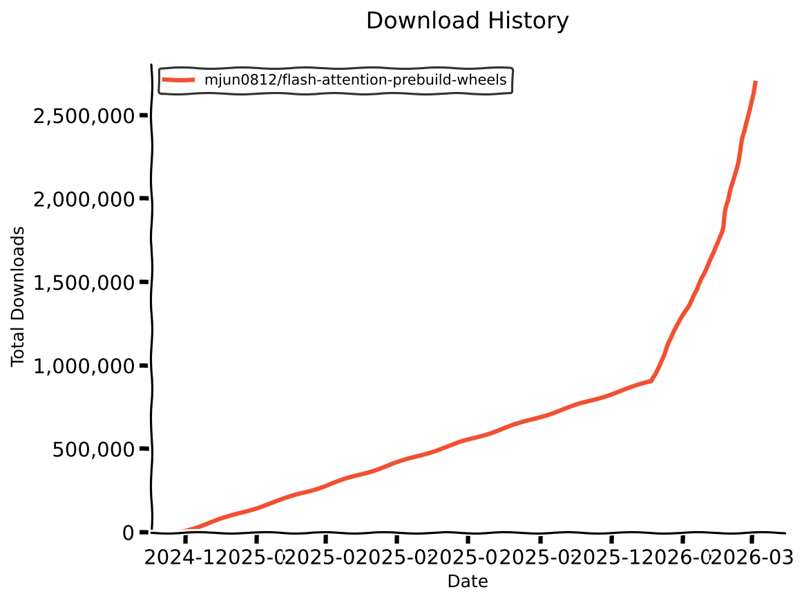

# flash-attention pre-build wheels


[](https://mjunya.com/flash-attention-prebuild-wheels/)

This repository provides wheels for the pre-built [flash-attention](https://github.com/Dao-AILab/flash-attention).

Since building flash-attention takes a **very long time** and is resource-intensive,
I also build and provide combinations of CUDA and PyTorch that are not officially distributed.

**This repository uses a self-hosted runner and AWS CodeBuild for building the wheels. If you find this project helpful, please consider sponsoring to help maintain the infrastructure!**

[](https://github.com/sponsors/mjun0812)
[](https://buymeacoffee.com/mjun0812)

**Special thanks to [@KiralyCraft](https://github.com/KiralyCraft) for providing the computing resources used to build wheels. Thank you!!**

## Install

1. Select the versions for Python, CUDA, PyTorch, and flash_attn.

```bash
flash_attn-[flash_attn Version]+cu[CUDA Version]torch[PyTorch Version]-cp[Python Version]-cp[Python Version]-linux_x86_64.whl

# Example: Python 3.11, CUDA 12.4, PyTorch 2.5, and flash_attn 2.6.3
flash_attn-2.6.3+cu124torch2.5-cp312-cp312-linux_x86_64.whl
```

2. Find the corresponding version of a wheel from the **[Useful Search Page](https://mjunya.com/flash-attention-prebuild-wheels/)**, [Packages](./doc/packages.md) page, or [releases](https://github.com/mjun0812/flash-attention-prebuild-wheels/releases) page.

3. Direct Install or Download and Local Install

```bash
# Direct Install
pip install https://github.com/mjun0812/flash-attention-prebuild-wheels/releases/download/v0.0.0/flash_attn-2.6.3+cu124torch2.5-cp312-cp312-linux_x86_64.whl

# Download and Local Install
wget https://github.com/mjun0812/flash-attention-prebuild-wheels/releases/download/v0.0.0/flash_attn-2.6.3+cu124torch2.5-cp312-cp312-linux_x86_64.whl
pip install ./flash_attn-2.6.3+cu124torch2.5-cp312-cp312-linux_x86_64.whl
```

## Packages

<!-- COVERAGE_START -->
### Coverage


| Platform | Existing | Missing | Coverage |
|----------|----------|---------|----------|
| Linux x86_64 | 169 | 2 | 98.8% |
| Linux ARM64 | 30 | 0 | 100.0% |
| Windows | 26 | 4 | 86.7% |
| **Total** | **225** | **6** | **97.4%** |
<!-- COVERAGE_END -->

> [!NOTE]
> Since v0.7.0, wheels are built with manylinux2_28 platform.
> These wheels for Linux x86_64 and ManyLinux are compatible with old glibc versions (<=2.17).

> [!NOTE]
> Since v0.5.0, wheels are built with a local version label indicating the CUDA and PyTorch versions.  
> Example: `pip list` -> `flash_attn==2.8.3 (old) -> flash_attn==2.8.3+cu130torch2.9 (>= built since v0.5.0)`

See [./doc/packages.md](./doc/packages.md) for the full list of available packages.

## History

The history of this repository is available [here](./doc/release_history.md).

## Citation

If you use this repository in your research and find it helpful, please cite this repository!

```bibtex
@misc{flash-attention-prebuild-wheels,
 author = {Morioka, Junya},
 year = {2025},
 title = {mjun0812/flash-attention-prebuild-wheels},
 url = {https://github.com/mjun0812/flash-attention-prebuild-wheels},
 howpublished = {https://github.com/mjun0812/flash-attention-prebuild-wheels},
}
```

## Acknowledgments

- [@okaris](https://github.com/okaris) : Sponsored me!
- [@xhiroga](https://github.com/xhiroga) : Sponsored me!
- cjustus613 : Buy me a coffee!
- [@KiralyCraft](https://github.com/KiralyCraft) : Provided with computing resource!
- [@kun432](https://github.com/kun432) : 2x Buy me a coffee!
- [@wodeyuzhou](https://github.com/wodeyuzhou) : Sponsored me!
- Gabr1e1 : Buy me a coffee!
- wp : Buy me a coffee!

## Star History and Download Statistics

<a href="https://www.star-history.com/#mjun0812/flash-attention-prebuild-wheels&type=date&legend=top-left">
  <picture>
    <source media="(prefers-color-scheme: dark)" srcset="https://api.star-history.com/svg?repos=mjun0812/flash-attention-prebuild-wheels&type=date&theme=dark&legend=top-left" />
    <source media="(prefers-color-scheme: light)" srcset="https://api.star-history.com/svg?repos=mjun0812/flash-attention-prebuild-wheels&type=date&legend=top-left" />
   
  </picture>
</a>



## Original Repository

[repo](https://github.com/Dao-AILab/flash-attention)

```bibtex
@inproceedings{dao2022flashattention,
  title={Flash{A}ttention: Fast and Memory-Efficient Exact Attention with {IO}-Awareness},
  author={Dao, Tri and Fu, Daniel Y. and Ermon, Stefano and Rudra, Atri and R{\'e}, Christopher},
  booktitle={Advances in Neural Information Processing Systems (NeurIPS)},
  year={2022}
}
@inproceedings{dao2023flashattention2,
  title={Flash{A}ttention-2: Faster Attention with Better Parallelism and Work Partitioning},
  author={Dao, Tri},
  booktitle={International Conference on Learning Representations (ICLR)},
  year={2024}
}
```

## Self build

If you cannot find the version you are looking for, you can fork this repository and create a wheel on GitHub Actions.

1. Fork this repository
2. (Optional) Set up your self-hosted runner.
3. Edit Python script [`create_matrix.py`](https://github.com/mjun0812/flash-attention-prebuild-wheels/blob/main/create_matrix.py) to set the version you want to build. You can use GitHub hosted runners or self-hosted runners.
4. Add tag `v*.*.*` to trigger the build workflow. `git tag v*.*.* && git push --tags`

Please note that depending on the combination of versions, it may not be possible to build.

### Self-Hosted Runner Build

In some version combinations, you cannot build wheels on GitHub-hosted runners due to job time limitations.
To build the wheels for these versions, you can use self-hosted runners.

#### Getting One-Time Registry Token for GitHub Actions Runner

```bash
gh api \
  -X POST \
  /repos/[OWNER]/[REPOSITORY]/actions/runners/registration-token
```

#### Setup Linux Self-Hosted Runner

Clone the repository and navigate to the self-hosted-runner directory.

```bash
git clone https://github.com/mjun0812/flash-attention-prebuild-wheels.git
cd flash-attention-prebuild-wheels/self-hosted-runner
```

Create environment files from the template. Create one file per architecture you want to build.

```bash
# For x86_64
cp env.template env

# For ARM64
cp env.template env.arm
```

Edit the environment file(s) to set the required variables.

```bash
# Registry Token for GitHub Personal Access Token
PERSONAL_ACCESS_TOKEN=[Github Personal Access Token]
# or Registry Token for GitHub Actions Runner
REGISTRY_TOKEN=[Runner Registry Token]

# Optional
RUNNER_LABELS=Linux,self-hosted
```

Edit the `compose.yml` file if you use a repository forked from this repository.

```yaml
runner:
  platform: linux/amd64
  privileged: true
  restart: always
  env_file:
    - .env
  environment:
    REPOSITORY_URL: https://github.com/[YOUR_USERNAME]/flash-attention-prebuild-wheels
    RUNNER_NAME: self-hosted-runner
    RUNNER_GROUP: default
    TARGET_ARCH: x64
  build:
    context: .
    dockerfile: Dockerfile
    args:
      GH_RUNNER_VERSION: 2.329.0
      TARGET_ARCH: x64
      PLATFORM: linux/amd64
  volumes:
    - fa-self:/var/lib/docker

runner-arm:
  platform: linux/arm64
  privileged: true
  restart: always
  env_file:
    - .env.arm
  environment:
    REPOSITORY_URL: https://github.com/[YOUR_USERNAME]/flash-attention-prebuild-wheels
    RUNNER_NAME: self-hosted-runner-arm
    RUNNER_GROUP: default
    TARGET_ARCH: arm64
  build:
    context: .
    dockerfile: Dockerfile
    args:
      GH_RUNNER_VERSION: 2.329.0
      TARGET_ARCH: arm64
      PLATFORM: linux/arm64
  volumes:
    - fa-self-arm:/var/lib/docker
```

Build and run the docker container(s).

```bash
# x86_64 runner
docker compose build runner
docker compose up -d runner

# ARM64 runner (optional)
docker compose build runner-arm
docker compose up -d runner-arm
```

## Build Environments

This repository builds wheels across multiple platforms and environments:

| Platform           | Runner Type                        | Container Image                           |
| ------------------ | ---------------------------------- | ----------------------------------------- |
| **Linux x86_64**   | GitHub-hosted (`ubuntu-22.04`)     | -                                         |
| **Linux x86_64**   | Self-hosted                        | `ubuntu:22.04` or `manylinux_2_28_x86_64` |
| **Linux ARM64**    | GitHub-hosted (`ubuntu-22.04-arm`) | -                                         |
| **Windows x86_64** | GitHub-hosted (`windows-2022`)     | -                                         |
| **Windows x86_64** | Self-hosted (`windows11`)          | -                                         |
| **Windows x86_64** | AWS CodeBuild                      | -                                         |
